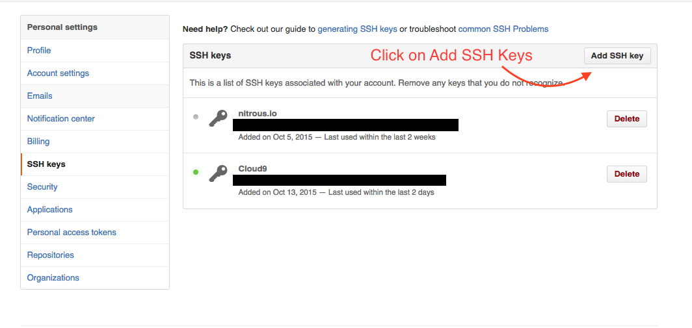

# GitHub Tutorial

_by Enrique Vivar_

---
## Git vs. GitHub
###Git: _Version control: Keeps "snapshots" of code_
* Does not require Github
* Used to :  
 * edit files
 * add files
 * commit them  

###Github:
* stores code in a cloud _(github.com)_
* able to tracks changes
* easily collaborate on files
* requires git 
* runs in the command line

---
## Initial Setup  
  ####Once a github account is created, you would have to connect your account _[cloud]_,
 to your terminal _[C9]_  
1. Create a c9 account  
2. Go to settings and click on SSH Keys  
3. Copy the SSH Key  
4. Head over to your Github.com account   
5. Go to settings  
6. Click on tab named SSH Keys  
7. Click on add SSH Keys  
  
8. Add a title, paste the SSH Key 
9. Save!

  ####Once saved, you'll also need an identity for your work. With `git config` 
  you will need to create a username and add an e-mail.
  
  

 
---
## Repository Setup

---
## Workflow & Commands