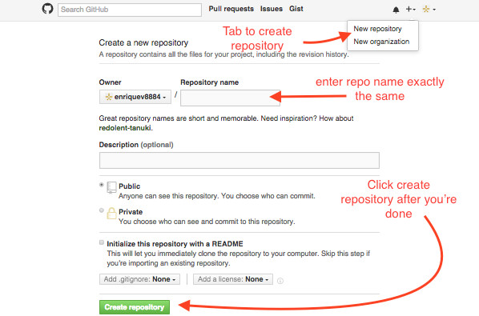

# GitHub Tutorial

_by Enrique Vivar_

---
## Git vs. GitHub
###Git: _Version control: Keeps "snapshots" of code_
* Does not require Github
* Used to :  
 * edit files
 * add files
 * commit them  

###Github:
* stores code in a cloud _(github.com)_
* able to tracks changes
* easily collaborate on files
* requires git 
* runs in the command line

---
## Initial Setup  
####Once a github account is created, you would have to connect your account _[cloud]_, to your terminal _[C9]_  
1. Create a c9 account  
2. Go to settings and click on SSH Keys  
3. Copy the SSH Key  
4. Head over to your Github.com account   
5. Go to settings  
6. Click on tab named SSH Keys  
7. Click on add SSH Keys    
8. Add a title, paste the SSH Key 
9. Save!

####Once saved, you'll also need an identity for your work. With `git config` you will need to create a username and add an e-mail.
  

`git config --global user.name`  
#####_user.name being desired name_
`git config --global user.email` 
#####_user.email is e-mail_

####With that you set your identity up, you're all good to go
---
## Repository Setup

####To start off, you will need to create a directory;
   `mkdir directory.name`   
#####_directory.name being what you want_
  
####With your new directory you will have to `cd` into it; 
   `cd directory.name`

####Within the directory, its recommended to create a README.md file;
   `touch README.md`

####Once the README.md is made, we can initialize it;
   `git init`
   
####Now that we have a repository, head to github.com and sign in.

1. Copy SSH Key and head back c9
2. Type `git remote add origin SSH Key` (SSH Key being the one you copied)
3. Then enter `git push -u origin master`
4. Now you're ready to work

---
## Workflow & Commands